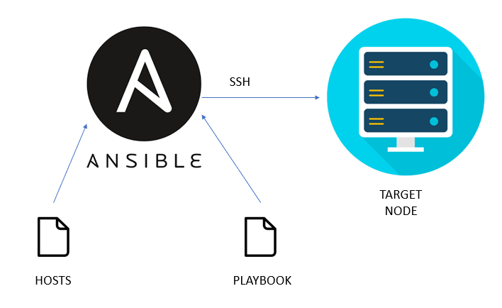
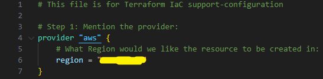
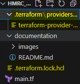
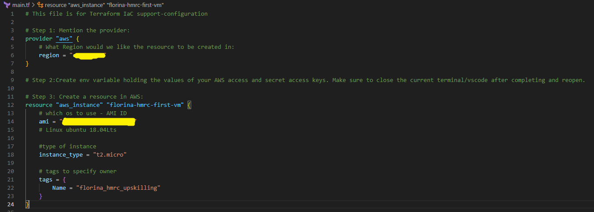
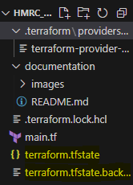

# Terraform Upskilling 
## A rvision of the basic concepts and itroduction to advanced use and techniques for Terraform. 


- **Infrastructure as Code (IaC)** uses a high-level descriptive coding language to *automate the provisioning of it Infrastructures.* 
- Tools used: **Terraform (Orhestration)** and **Ansible(Configuration mangement)**.
        
    1. **Orhestration** (with *Terraform*) = Automated deployment, configuration, and management of complex applications and infrastructure across multiple systems/cloud environments. 
        - **Terraform** = open-source tool for building, changing, and versioning infrastructure safely and efficiently across multiple cloud providers (uses Hashicorp Configuration Language to define resources as code and automates the deployment and management of these resources in a consistent and repeatable way).

        
    

    2. **Configuration management** (with *Ansible*) = Proces of identifying and tracking the state of a system`s components and ensuring they are properly configured, update, and maintained over time. 
        - *Ansible* = open-source IT automation tool that simplifies the deloyment, configuration, and management of systems and applications (uses YAML to define config files called playbooks which describe the desired state of a system). 

        

---

## Day 1 practical work:

- ***Understanding Terraform basics:***

    - `main.tf` is the main congifuration file for the IaC. Here we will define the infrastructure we want to create. 
    - When *runing terraform commands* based on a specific main.tf, your location in the terminal *must be in the directory containing that specific main.tf*.
    - First thing to be mentioned in a main.tf file is the **provider**, an the syntax would look as follows (at the simplest level):

    

    - To initialize the terraform backed (in this case, on our device) that specifies the provider that we use, run:
    ```
    terraform init
    ```
    - Once the initialize command has been run, you will notice the creation of the following files/directories:

    

        - .terraform\providers directory -> terraform-provider-aws = executable file managed by the `terraform init` command, holding the instructions for terraform to configure the backend for specific providers specified in main.tf (in this case aws).
        - .terraform.lock.hcl                                      = records the provider selection defined in main.tf. 

    - In order to be able to create resources in aws via terraform, we must encode the AWS access key and secret access key as environment variables (on our device). **We must never hardcode the aceess keys from AWS in main.tf or anywhere else in the terraform project!**
    - To create resources, we must no create the syntax accordingly. For an ec2 instance hosting linux OS, the syntax would look as follows (at a basic level):
    
    

    - To check the code for errors, run:
    ```
    terraform plan
    ```
    - Once we ensured the syntax is correct, we can run:
    ```
    terraform apply

    # you will be prompted to type yes/no after reviewing the infrastructure additions/changes/removals that terraform will be performing
    ```
    - Once terraform has been given the approval to perform the apply, we wll notice the creation of new files:

    

        - terraform.tfstate        = a JSON formatted mapping of the resources defined in the configuration and those that exist in your infrastructure (CURRENT STATE).
        - terraform.tfstate.backup = created by default, it is a backup of your state file in case the state file is lost or corrupted to simplify recovery.

    - To now destroy any resources created withterraform apply, simply run:
    ```
    terraform destroy

    # you will be prompted to type yes/no as a confirmation of the action of destroying the infrastructure
    ```

---


